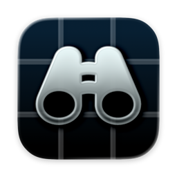

  

# Vibe Swift Token Monitor

**[简体中文](README.md) · English**

A native macOS usage and quota monitor built for Codex. See local and multi-device usage, account quotas, model distributions, and activity history in one compact window.

Version 0.7.1 adds a selectable quota cycle heatmap, device and model quota/token views, and GPT-6 pricing estimates. Collection uses Swift without Node.js, Tokscale, or Electron and can continue after the interface quits.

## Download 0.7.1

**[Download DMG](https://github.com/Eldershi/Vibe-Swift-Token-Monitor/releases/download/v0.7.1/Token-Monitor-Native-0.7.1-68-arm64.dmg)** · [Download ZIP](https://github.com/Eldershi/Vibe-Swift-Token-Monitor/releases/download/v0.7.1/Token-Monitor-Native-0.7.1-68-arm64.zip) · [SHA-256](https://github.com/Eldershi/Vibe-Swift-Token-Monitor/releases/download/v0.7.1/SHA256SUMS) · [Release notes](https://github.com/Eldershi/Vibe-Swift-Token-Monitor/releases/tag/v0.7.1)

Apple Silicon · macOS 26 or later · Build 68 · Simplified Chinese / English

The app is ad-hoc signed and not notarized. Build and runtime verification used macOS 27; testing on a physical macOS 26 system remains outstanding.

## What you can see

- **Overview:** Codex usage, quotas, devices, and models, with configurable section order, visibility, and colors.
- **Activity:** model and device donuts, a heatmap, hourly / daily / monthly trends, and full breakdowns and records.
- **Quota:** three donut pages for official used / remaining quota, devices, and models. Click a distribution donut or summary progress bars to toggle quota shares and cycle tokens.
- **Cycle heatmap:** with a Hub supporting cycles and quota history, select a cycle to update quota, device, and model views together. Gray intensity reflects the last valid observed usage; selected and hovered cycles use the accent color.
- **Menu bar:** weekly remaining quota as a ring and percentage by default, with optional today tokens, short-term quota, and display styles.
- **Personalization:** a 320 pt window, light / dark appearance, per-item chart colors, and local display names that leave Hub identifiers unchanged.

Donuts and bars use outlines for hover feedback, with complete readings in details. Missing, stale, and reported zero values stay distinct.

## Get started

1. Download the DMG or ZIP and move **Token Monitor.app** to Applications.
2. Open Settings → Data, enable background collection as needed, and allow the first Codex log scan to finish.
3. For multi-device totals, enter an existing Hub URL and secret, validate the connection, and select this Mac's existing device record.

**Upgrading from 0.6 or earlier: disable the old Hub uploader and background service, quit the old app, then install 0.7.1 manually.** This version uses a separate data directory and requires connection setup again. Keep the old sync baseline and use only one uploader per device. Users of 0.7.0-beta.2 retain their data directory; stop the old service before replacing that app too. [Upgrade details](docs/USAGE.md#english)

[Usage guide](docs/USAGE.md#english) · [Build and architecture](docs/BUILDING.md) · [Report an issue](https://github.com/Eldershi/Vibe-Swift-Token-Monitor/issues)

## Data and limitations

Local collection reads Codex logs. Quota queries use the existing Codex sign-in state without renewing credentials or starting model sessions. Optional Hub sync sends statistics, models, device information, and pseudonymous account quota observations, excluding prompts, conversation content, and sign-in credentials.

Current quota allocation uses recent complete-day cost weights; historical cycles use available complete days within that cycle. Both are approximate and do not measure individual requests or predict remaining tokens. Historical tokens cover available complete days only; insufficient evidence stays missing. Inferred cycles do not prove that every percentage reset was observed.

GPT-6 Astra / Sol / Luna estimates use the September 24, 2026 [official API prices](https://developers.openai.com/api/docs/pricing) and [Codex credit table](https://learn.chatgpt.com/docs/pricing). Local logs must completely match device model token totals before repricing. Missing speed tiers assume Standard; unknown models, including codex-auto-review, remain unpriced. Costs are API-equivalent estimates, not subscription bills. These calculations affect display and allocation only, do not backfill the Hub upload ledger, and do not automatically repair other devices’ prices.

## Relationship and licensing

Inspired by [Javis603/token-monitor](https://github.com/Javis603/token-monitor), with an independently developed and maintained native Swift client and collector compatible with its **v0.56.0 Hub API baseline**. Compatibility depends on actual endpoints and capabilities; it is not a blanket guarantee for every upstream release or extension.

Version 0.7.0 no longer distributes the upstream Node backend or Tokscale. Previously reused MIT code remains in historical tags, with attribution retained. See [third-party notices](TokenMonitorNative/THIRD_PARTY_NOTICES.md) for Sparkle, system symbols, and device icons. This is not an official OpenAI or upstream-author client. No unified open-source license has yet been assigned to the new code in this repository.
